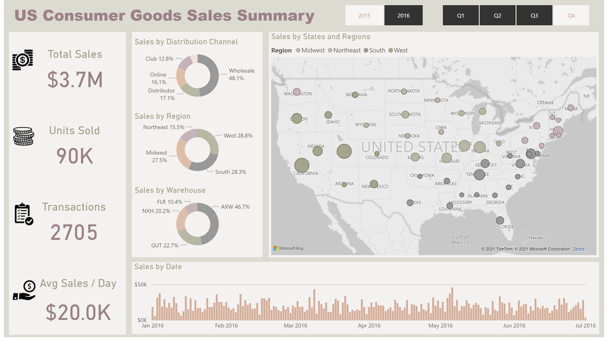

![Project Logo][project_logo]

The following interactive Power BI dashboard helps in analyzing the consumer goods sales in the United States

All the visuals in the dashboards cross-filters one-another which helps in deep-dive analysis of the data.

This one pager dashboard shows the following:

- **Map Visual**: Goods sales by state & regions
- **Column Trend Visual**: Sales over period
- **Donut visuals**: Profit by distribution channel, region & warehouse
- **KPI Card visuals**: Total sales, Units sold, Total Transactions & Avg. Sales per Day

[project_logo]: ../06_RESOURCES/project_cover_image.png
[pbi_image]: ../06_RESOURCES/dashboard_image.png
[pbi_link]: https://app.powerbi.com/view?r=eyJrIjoiNDc2OTgzNDctMzk1ZC00YjcxLWE1YmQtZmU1ODViNDU3ZmQwIiwidCI6IjcwODlkNGIxLTQyMmUtNDYzZi1hNGM3LTViY2FiOTk0MGRiZCJ9&pageName=ReportSection
